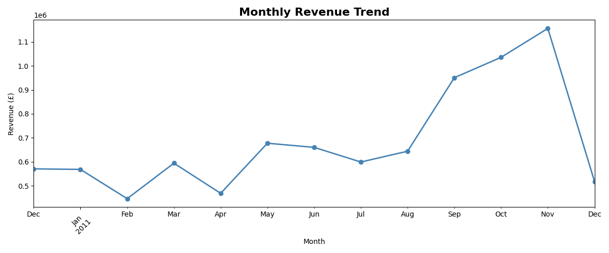
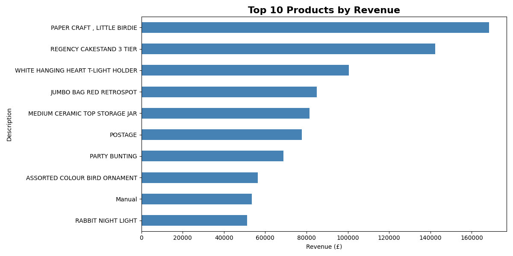
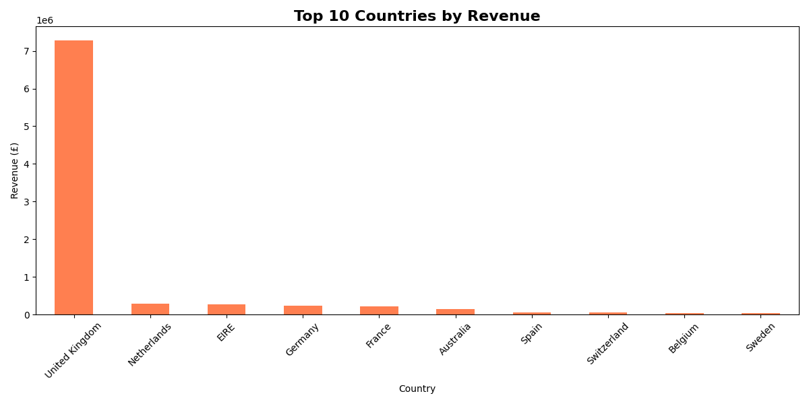
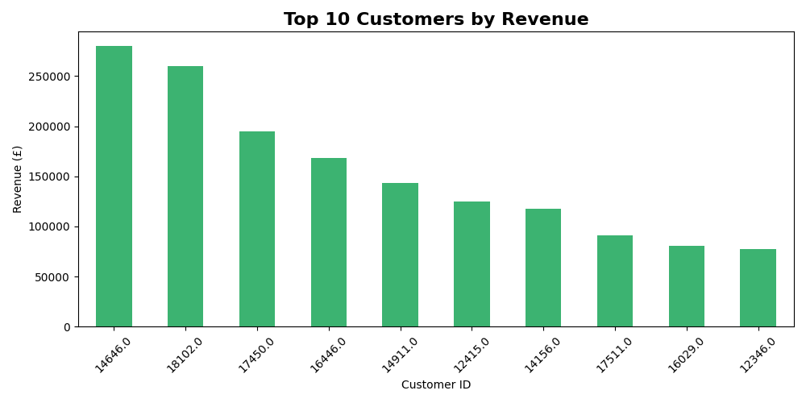

# Business Sales Performance Analytics
## Future Interns — Data Science & Analytics Task 1

### Overview
Analyzed an online retail dataset with 500,000+ transactions to
identify revenue trends, top products, and regional performance.

### Tools Used
- Python (Pandas, Matplotlib)
- VS Code

### Key Insights
- November 2011 was the peak revenue month at £1.14M — nearly
  double the average — driven by pre-Christmas demand
- PAPER CRAFT, LITTLE BIRDIE was the #1 product at £168,000 in revenue
- United Kingdom accounts for over 85% of total revenue —
  Netherlands and Germany are the most promising growth markets
- Top customer (ID 14646) spent £280,000 — a VIP retention
  programme is strongly recommended

### Charts

### Dataset
Online Retail Dataset from Kaggle
